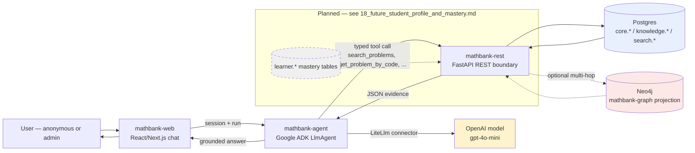

# MathBank Agent — Design & Flow Documentation

This directory documents the **agentic layer** built on top of the data
platform in `mathematics_tutor_db_plan/` (Postgres system of record + Neo4j
graph projection + `search.*` pgvector/hybrid-RAG subsystem) and
`mathematics_tutor_db_plan_v2/vector/` (the vector/RAG subsystem itself).

Implementation lives in three sibling projects at the repo root:

| Project | Role |
|---|---|
| [`mathbank-rest/`](../../mathbank-rest) | FastAPI service; the *only* read/write boundary to Postgres — hybrid RAG search + corpus lookups |
| [`mathbank-agent/`](../../mathbank-agent) | Google ADK agent (OpenAI models via LiteLLM); tools call `mathbank-rest` only, never Postgres directly |
| [`mathbank-web/`](../../mathbank-web) | Minimal React chat frontend; talks to `mathbank-agent`'s ADK REST server only |

For how the underlying Postgres/Neo4j/search data actually got populated, see
[`../00_implementation_progress.md`](../00_implementation_progress.md) — this
directory assumes that data already exists and documents what's built *on top*
of it.

## Documents

### As-implemented (matches the running mathbank-agent/mathbank-rest/mathbank-web)

1. [**01_architecture_and_design.md**](01_architecture_and_design.md) —
   component diagram, why Google ADK + LiteLLM/OpenAI (not Gemini), why tools
   call REST instead of Postgres directly, tool catalog.
2. [**02_ingestion_pipeline_flow.md**](02_ingestion_pipeline_flow.md) —
   end-to-end data flow from raw corpus (CSV + crawled PDFs/AoPS pages) through
   Postgres, embeddings, and the Neo4j graph projection. Summarizes/links the
   five ingestion rounds already completed.
3. [**03_inference_and_retrieval_flow.md**](03_inference_and_retrieval_flow.md) —
   what happens, step by step, between a user typing a question and the agent
   replying: session creation, function-calling, hybrid RRF SQL, response
   synthesis. Sequence diagram included.
4. [**04_example_queries.md**](04_example_queries.md) — several fully worked
   example queries (including the flagship *"What are the recent questions on
   combinatorics?"*, run live against the real system) with the exact tool
   call, REST request/response, and underlying SQL for each.
5. [**05_frontend_and_api_contract.md**](05_frontend_and_api_contract.md) —
   the React ↔ ADK REST contract (`/apps/.../sessions/...`, `/run`), request/
   response shapes, and the REST endpoints `mathbank-rest` exposes to tools.
6. [**06_security_and_access_model.md**](06_security_and_access_model.md) —
   today's anonymous/admin model, what's intentionally *not* implemented yet
   (student profiles, attempt history, mastery-aware retrieval), and the
   planned extension points.

### Fuller design — richer detail, some not yet implemented (merged from
`mathematics_tutor_architecture_v3_adk_openai`, 2026-10-04)

Each file below has a **Status** banner at the top noting what's already
built vs still design-only. Read these for the *why* behind the boundaries
above, and for everything not yet built (admin tools, observability,
student/mastery, deployment hardening).

7. [**07_system_architecture_and_boundaries.md**](07_system_architecture_and_boundaries.md) — layered architecture, strong ADK/REST/Postgres boundaries, non-goals.
8. [**08_adk_openai_model_layer.md**](08_adk_openai_model_layer.md) — model/provider abstraction, what the LLM may/may not decide, dependency pinning.
9. [**09_agent_tool_design.md**](09_agent_tool_design.md) — full public + admin tool catalog, narrow-schema principle, tool result contract.
10. [**10_query_understanding_and_planning.md**](10_query_understanding_and_planning.md) — why "recent" and taxonomy resolution belong in REST, not the LLM; query classes.
11. [**11_hybrid_rag_execution.md**](11_hybrid_rag_execution.md) — candidate stages, RRF fusion, dedup, no-answer behavior.
12. [**12_rest_contracts_for_agent.md**](12_rest_contracts_for_agent.md) — the fuller `/v1/search/questions`-style contract (REST invariants, error envelope, analytics endpoints).
13. [**13_anonymous_and_admin_security.md**](13_anonymous_and_admin_security.md) — principal classes, defense in depth, prompt-injection handling, rate limiting.
14. [**14_evidence_context_and_answering.md**](14_evidence_context_and_answering.md) — grounded-answer rule, evidence record shape, hallucination defenses.
15. [**15_example_query_flows.md**](15_example_query_flows.md) — additional worked flows (structured browse, technique semantics, follow-ups, aggregates, admin diagnostics).
16. [**16_observability_and_evaluation.md**](16_observability_and_evaluation.md) — tracing, metrics, golden evaluation set, security evaluation, replayability.
17. [**17_deployment_and_configuration.md**](17_deployment_and_configuration.md) — deployable units, secrets, scaling, caching, timeouts.
18. [**18_future_student_profile_and_mastery.md**](18_future_student_profile_and_mastery.md) — **student mastery extraction**: end-to-end Mermaid flow, new `learner.*` Postgres schema, new `Student`/`MASTERED`/`STRUGGLES_WITH` graph attributes, mastery-score formula.
19. [**19_reference_python_skeleton.md**](19_reference_python_skeleton.md) — structural example project layout/config/tool/agent code.
20. [**20_implementation_sequence.md**](20_implementation_sequence.md) — phased build order, with status notes on what's already done.
21. [**21_adk_openai_version_notes.md**](21_adk_openai_version_notes.md) — upstream ADK/LiteLLM references and dependency-pinning notes.

## End-to-end flow (current + planned)

Nothing in the agent or frontend ever talks to Postgres or Neo4j directly —
`mathbank-rest` is the sole boundary, matching the governing rule from
`mathematics_tutor_db_plan/README.md`: *"nothing exists only in the graph"*
extends here to *"nothing is answered that the REST API didn't return."*
