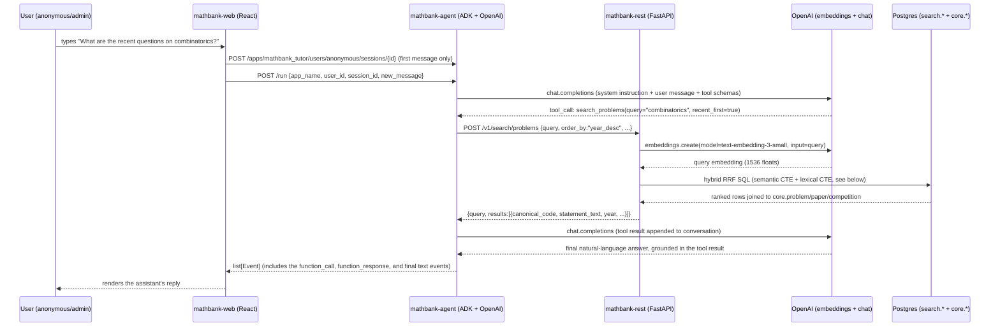

# Agent 03 — Inference and Retrieval Flow

## Sequence: one chat turn, end to end



## Step-by-step detail

### 1. Session creation (once per browser tab)

`mathbank-web` generates a random `session_id` and calls
`POST /apps/mathbank_tutor/users/{user_id}/sessions/{session_id}` against the
ADK REST server. `user_id` is `"anonymous"` today (see
[06_security_and_access_model.md](06_security_and_access_model.md)).

### 2. `POST /run`

```json
{
  "app_name": "mathbank_tutor",
  "user_id": "anonymous",
  "session_id": "web-172...-ab12cd",
  "new_message": {"role": "user", "parts": [{"text": "What are the recent questions on combinatorics?"}]}
}
```

ADK's `Runner` loads the session, appends the message, and invokes the LLM
(`openai/gpt-4o-mini` via LiteLLM) with the agent's system instruction, the
conversation so far, and the JSON-schema declarations auto-generated from
`search_problems`/`get_problem_by_code`/etc.'s Python signatures.

### 3. Tool selection and call

The model decides which tool(s) to call and with what arguments — this is
standard OpenAI function calling, routed through LiteLLM. For a "recent
questions on X" phrasing, the system instruction explicitly tells the model
to set `recent_first=true`; ADK executes `search_problems(...)` as a normal
Python function call (synchronous `httpx` call to `mathbank-rest`) and feeds
the return value back to the model as a tool result message.

### 4. Hybrid retrieval inside `mathbank-rest`

`POST /v1/search/problems` → `vector_search.search_problems()`:

1. Look up the **active** embedding model row (`search.embedding_model`,
   `status='ACTIVE'`) — the agent/caller never specifies a model.
2. Embed the query text via OpenAI (`text-embedding-3-small`), independently
   of whatever model the agent's LLM is using.
3. Run the hybrid RRF SQL (semantic CTE over `search.embedding` using the
   HNSW index + lexical CTE over `search.chunk.textsearch`, fused with
   `1/(60+rank)` reciprocal-rank fusion — see
   `mathematics_tutor_db_plan_v2/vector/10_reference_sql_and_query_examples.md`
   §8–11 for the reference pattern this implements verbatim).
4. Apply hard filters (`competition`, `year_min`/`year_max`) as plain SQL
   `WHERE` clauses — filters are **not** part of the embedding, they constrain
   the candidate set directly (correct and fast, unlike trying to encode
   "year >= 2020" into a vector).
5. If `order_by="year_desc"`, re-sort the final candidate set by year instead
   of by RRF score (see `04_example_queries.md` for why this matters for
   "recent" questions specifically).

### 5. Response synthesis

The tool result (a JSON object with up to `limit` ranked problems) is
returned to the LLM as a function-call result message. The system
instruction requires the model to cite `canonical_code` + competition/year
for anything it mentions, and forbids inventing problems — so the final
answer is grounded entirely in what step 4 actually returned.

### 6. Event list back to the frontend

`POST /run` returns the full list of ADK `Event`s for this turn — including
the `function_call` event, the `function_response` event, and the final
assistant `text` event. `mathbank-web`'s `agentClient.js` filters for
non-user text parts and concatenates them for display; a richer UI could
also render the intermediate tool-call events (e.g. "searching problems on
combinatorics…") for transparency.

## Where RAG and Postgres actually meet

It's worth being explicit that there are **two separate OpenAI calls** per
turn, for two different purposes:

| Call | Model | Why |
|---|---|---|
| Agent reasoning / tool selection / final answer | `gpt-4o-mini` (chat) | Decide which tool(s) to call, with what args, and phrase the final answer |
| Query embedding | `text-embedding-3-small` (embeddings) | Turn the user's natural-language query into a vector for pgvector's cosine search |

The same embeddings model was used to embed the entire corpus during
ingestion (Round 5) — using a *different* embeddings model for queries than
for the corpus would produce meaningless cosine distances. `mathbank-rest`
enforces this implicitly by always looking up the single `ACTIVE`
`search.embedding_model` row rather than accepting a model choice from the
caller.
