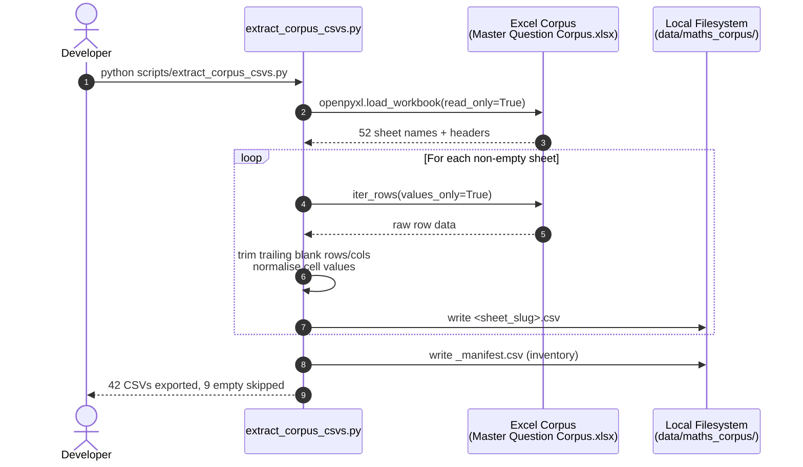
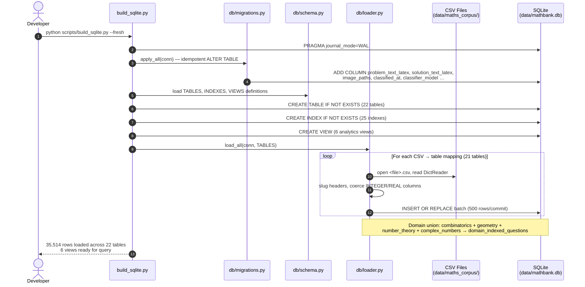
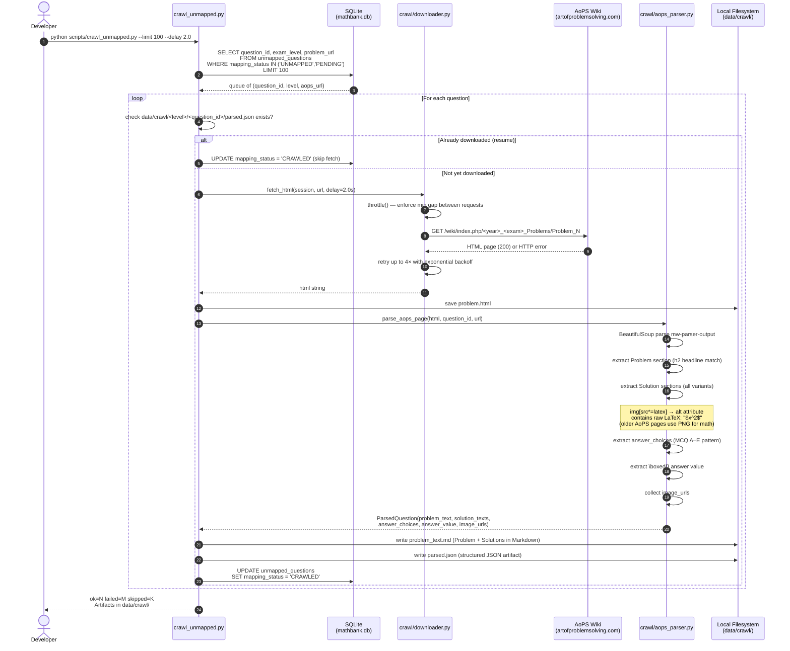
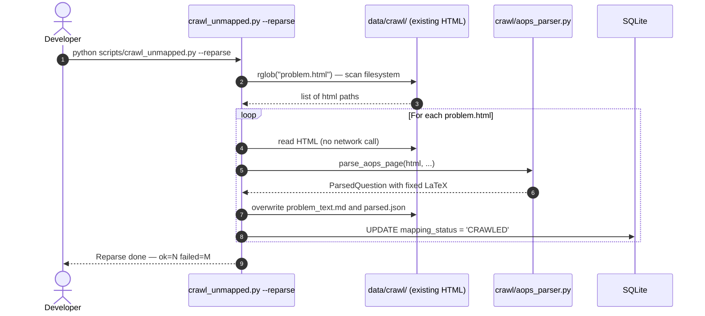
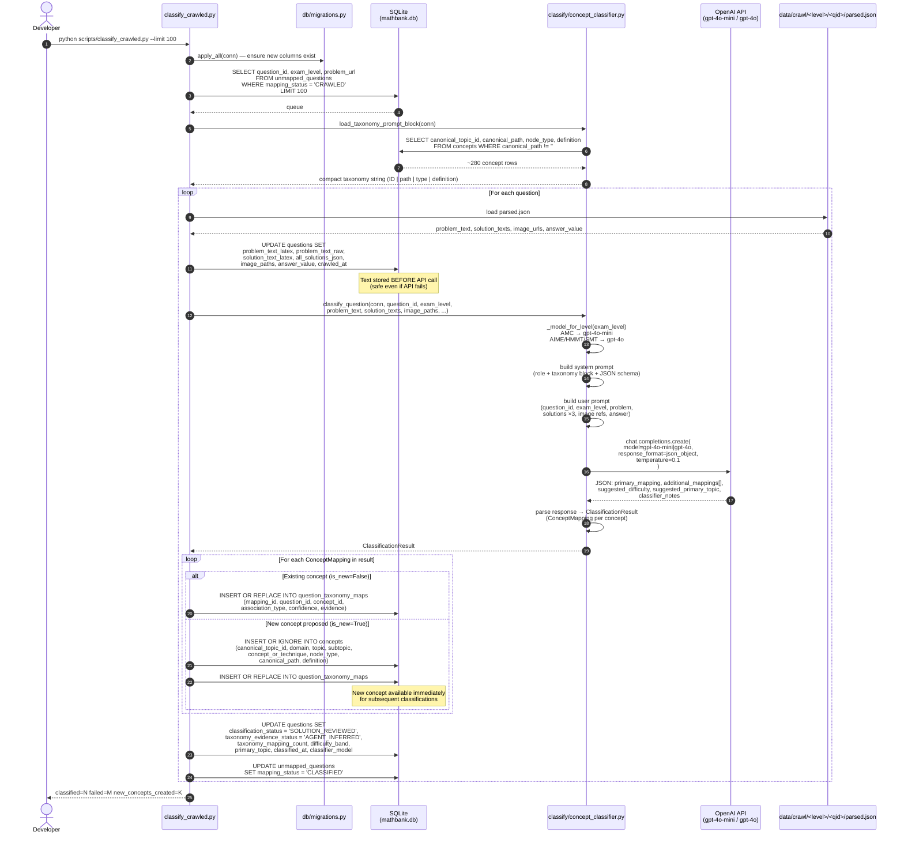
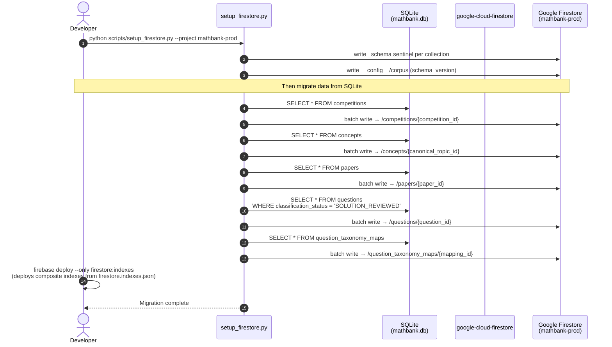
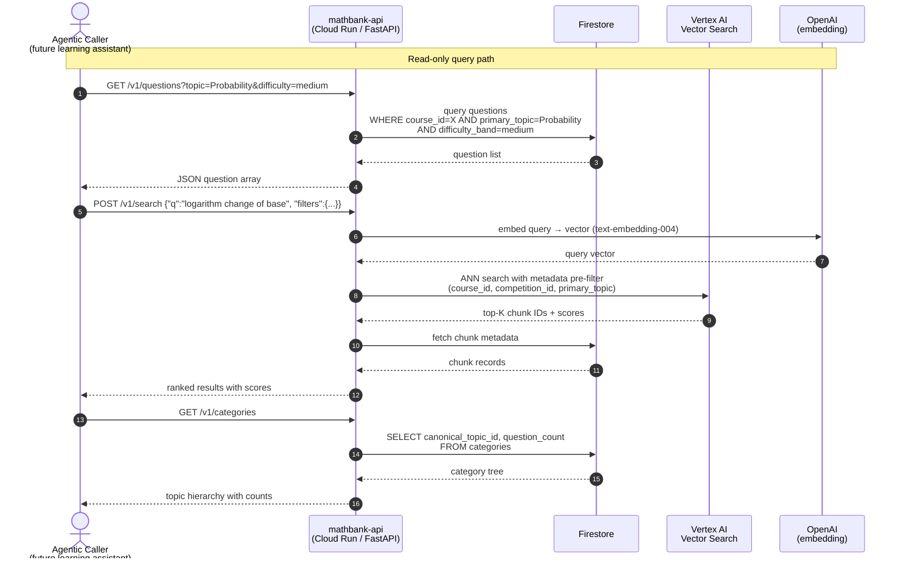
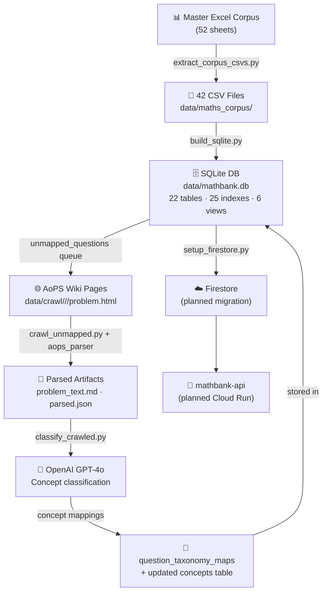

# MathBank — Pipeline Sequence Diagrams

Five phases: Extract → Build → Crawl → Classify → (Migrate / API)

---

## Phase 0 — Extract CSVs from Master Excel

---

## Phase 1 — Build Local SQLite Database

---

## Phase 2 — Crawl Unmapped Questions from AoPS

### Reparse variant (no network)

---

## Phase 3 — OpenAI Concept Classification

---

## Phase 4 — Firestore Migration (planned)

---

## Phase 5 — API & RAG (planned)

---

## End-to-End Data Flow Summary

