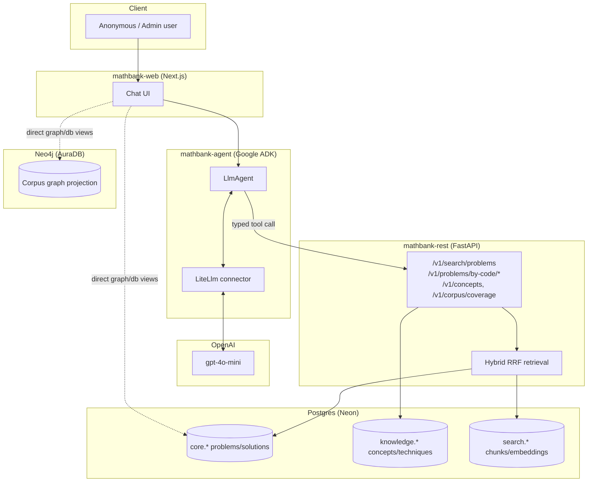
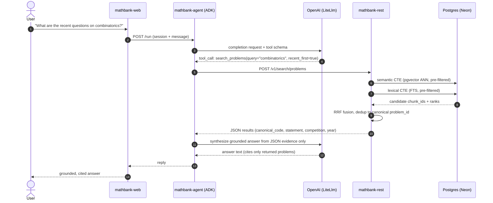
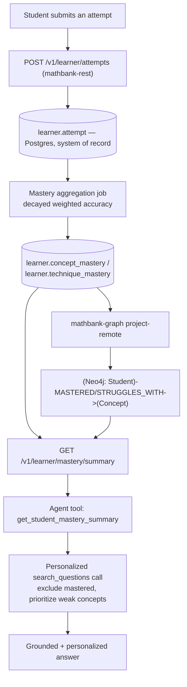

# MathBank — Agentic Tutor and Student Mastery Requirements

This document extends the corpus/RAG requirements (docs 01-09) to cover the
**agentic tutor layer**: the Google ADK + OpenAI query agent already running
in `mathbank-agent`, the REST/Postgres/graph boundary it depends on, and the
**not-yet-built** student mastery extraction pipeline needed for a true
personalized tutor. It also captures what scales as more competition papers
are parsed, more graph nodes are projected, and more REST vector/AI
endpoints are added.

Full design detail lives in
[`mathematics_tutor_db_plan/agent/`](../mathematics_tutor_db_plan/agent/00_index.md)
(21 files) — this document is the requirements-level summary with
requirement IDs, per the `00_INDEX.md` naming convention.

## Naming

- `AGT-*` — agentic tutor / agent-layer requirements
- `MST-*` — student mastery extraction requirements

---

## 1. Current state (implemented)

| Requirement | Description | Status |
|---|---|---|
| AGT-01 | Google ADK `LlmAgent` with OpenAI model via `LiteLlm` connector, not Gemini | ✅ done — `mathbank-agent/agents/mathbank_tutor/agent.py` |
| AGT-02 | Agent tools call `mathbank-rest` only; never query Postgres/Neo4j directly | ✅ done |
| AGT-03 | Anonymous-only principal class in v1; no student identity | ✅ done (by design) |
| AGT-04 | Hybrid RRF retrieval (pgvector + Postgres FTS), pre-filtered before ranking | ✅ done — see root `GOTCHAS.md` for the pre-filter-vs-post-filter bug fixed in `vector_search.py` |
| AGT-05 | Full corpus graph projection (Competition/Paper/Problem/Solution/Concept/Technique nodes) | ✅ done — `mathbank-graph`, now running against remote Neon + AuraDB |
| AGT-06 | Web graph + Postgres browsing UI (`/graph`, `/db`) with master/detail views | ✅ done — `mathbank-web` |

## 2. End-to-end agent architecture

## 3. Worked query flow (verified live) — "recent questions on combinatorics"

---

## 4. Scaling requirements — more papers, more graph nodes, more REST/vector endpoints

| Requirement | Description |
|---|---|
| AGT-07 | New competitions/papers added via `mathbank_data_ingestion` crawl → `export_classifications_to_csv.py` → `etl`/`etl-remote` → `project`/`project-remote` pipeline (see root `DATABASES.md` "Full corpus pipeline") must remain idempotent — verified via the duplicate-key audit in `export_classifications_to_csv.py` and `ON CONFLICT`-backed Postgres upserts. |
| AGT-08 | Graph projection must scale by re-running `project-remote`, not by hand-editing Neo4j — new `Concept`/`Technique` nodes and `TESTS`/`USES_TECHNIQUE`/`CONCEPT_RELATION` edges come from Postgres `knowledge.*`, never written directly to Neo4j. |
| AGT-09 | New REST vector/AI endpoints (e.g. `/v1/search/similar-questions`, `/v1/analytics/technique-frequency`) must follow the existing contract shape in `mathematics_tutor_db_plan/agent/12_rest_contracts_for_agent.md` — versioned `/v1`, `effective_filters` in the response, REST (not the LLM) resolves ambiguity/time windows. |
| AGT-10 | Each new REST endpoint that touches `search.embedding` must declare its retrieval profile/embedding model version explicitly (see `vector/06_embedding_pipeline_reembedding_and_versioning.md`) so re-embedding doesn't silently change past answers without a version bump. |

---

## 5. Student mastery extraction (MST-*) — not yet implemented

Full design: [`mathematics_tutor_db_plan/agent/18_future_student_profile_and_mastery.md`](../mathematics_tutor_db_plan/agent/18_future_student_profile_and_mastery.md).
Summary with requirement IDs below.

### 5.1 End-to-end mastery flow

### 5.2 Requirements

| Requirement | Description |
|---|---|
| MST-01 | New `learner` Postgres schema: `student_profile`, `attempt`, `concept_mastery`, `technique_mastery` — additive to `core.*`/`knowledge.*`, never required by anonymous/admin flows. |
| MST-02 | `learner.attempt` is the only write path for mastery data — `concept_mastery`/`technique_mastery` are **derived**, recomputed by a scheduled/on-demand job, never written directly by the application (mirrors how `search.embedding` is derived from `core.problem`/`core.solution`). |
| MST-03 | Mastery score = time-decayed, difficulty-weighted accuracy (see formula in agent/18 §5), not a raw percentage — must support a configurable half-life and per-concept-role (`PRIMARY`/`SECONDARY`) weighting from `knowledge.problem_concept`. |
| MST-04 | New Neo4j node label `Student` (`canonical_id` only — no PII) and edges `MASTERED`, `STRUGGLES_WITH`, `ATTEMPTED`, `MADE_ERROR`, projected into a **separate learner graph/subgraph**, never merged into the shared anonymous-readable corpus graph. |
| MST-05 | `MASTERED`/`STRUGGLES_WITH` edges are threshold-projected (e.g. `score >= 0.8` / `score < 0.4`), not a raw score property on every concept edge, to keep the graph sparse and Cypher traversal natural (prerequisite-gap queries, recommendation queries). |
| MST-06 | New agent tool `get_student_mastery_summary(student_id)` — the agent biases retrieval using its output (exclude mastered, prioritize struggling); the agent never computes mastery itself. |
| MST-07 | Corpus embeddings (`search.embedding`) remain shared across all students — mastery/personalization must work by filtering/boosting existing embeddings, never by creating per-student embeddings. |
| MST-08 | `learner.student_profile.external_auth_subject` is the only PII-adjacent linkage; deleting a student is a single-row cascade, not a corpus-wide scrub — required for privacy/erasure compliance. |

---

## 6. Acceptance criteria

1. Re-running the full ingestion→classification→graph pipeline for a newly
   added competition produces zero duplicate rows in Postgres or Neo4j
   (verified by the existing duplicate-key audits).
2. A new REST vector/AI endpoint added for a future feature follows the
   `/v1` + `effective_filters` + versioned retrieval-profile contract.
3. (Future) Submitting a student attempt updates `learner.attempt`, and a
   subsequent mastery-aggregation run updates `learner.concept_mastery`
   without touching `core.*`/`knowledge.*`/`search.*`.
4. (Future) `get_student_mastery_summary` returns correct mastered/struggling
   concept lists purely from `learner.*`/graph data, with no change to
   anonymous search behavior.
