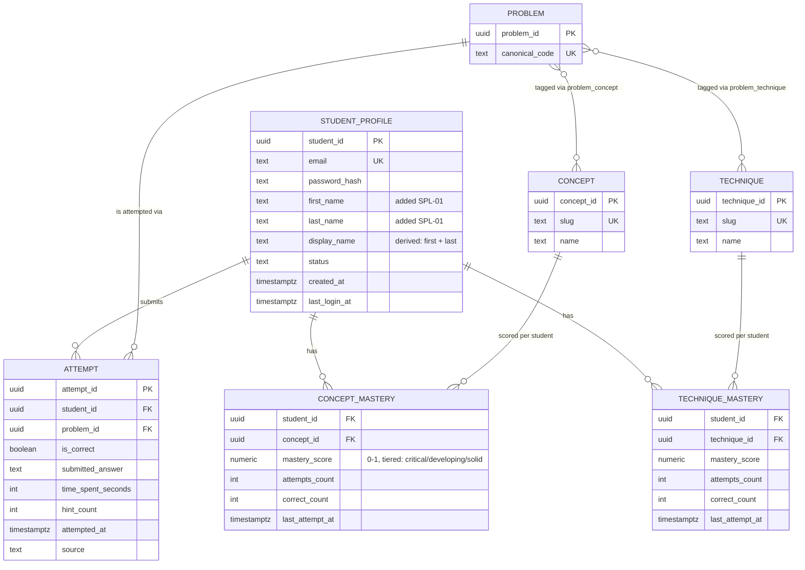
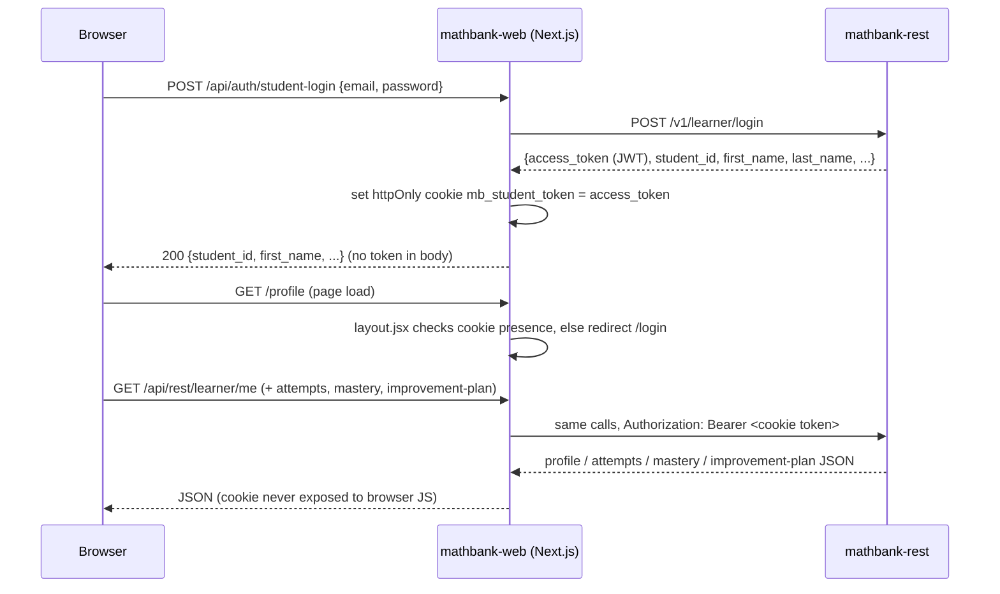
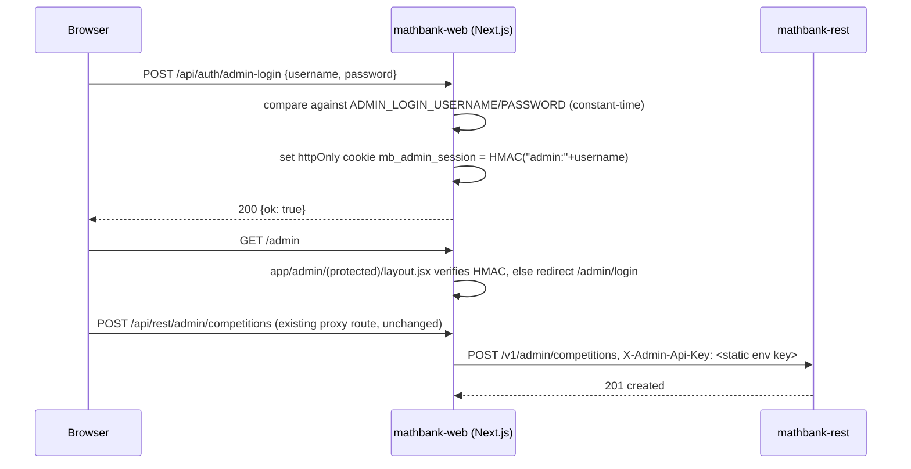

# Student Profile & Admin Login UI Requirements

This document covers the first real UI surface for student accounts (login,
registration, profile dashboard — past attempts, strength/weakness by
concept, "what to improve next") and a predefined-credential admin login
that gates the existing `/admin` corpus-ingestion UI. Both logins are an
explicit **bridge until real OAuth is built** — scoped and named so that
swap-out is a config/endpoint change, not a rewrite.

Builds on, and does not duplicate:
- `requirements/10_AGENTIC_TUTOR_AND_STUDENT_MASTERY_REQUIREMENTS.md` (MST-*) —
  the Postgres `learner.*` schema, mastery scoring formula, and the
  `improvement-plan`/`weak-concepts` analytics endpoints already existed.
- `requirements/11_SYSTEM_DIAGRAMS_TESTING_AND_METRICS.md` — admin API-key
  auth pattern (`X-Admin-Api-Key`), the existing `/admin` ingestion UI.

## 1. Naming

Requirement IDs use prefix `SPL-*` (Student Profile & Login).

## 2. Entity-relationship diagram

Admin login has **no new table** — it's a predefined single account compared
against env vars (`ADMIN_LOGIN_USERNAME`/`ADMIN_LOGIN_PASSWORD` in
`mathbank-web/.env`), gating the Next.js `/admin` UI only. The
pre-existing `/v1/admin/*` REST authorization (`X-Admin-Api-Key`) is
**unchanged** — the web login does not touch `mathbank-rest`'s admin auth
at all, by design (see SPL-07).

## 3. Sequence diagrams

### 3.1 Student login / register → profile dashboard

### 3.2 Admin login → protected `/admin` UI

## 4. Requirements

| Requirement | Description | Status |
|---|---|---|
| SPL-01 | `learner.student_profile` gains `first_name`/`last_name` columns (`mathbank-db/sql/005_student_profile_names.sql`, idempotent `ADD COLUMN IF NOT EXISTS`); `display_name` is derived as `"first_name last_name"` at write time, kept as its own column for display/back-compat. `POST /v1/learner/register` now requires both as non-empty fields. | ✅ done |
| SPL-02 | `GET /v1/learner/attempts` (authenticated, paginated `limit`/`offset`) lists a student's own past attempts, most-recent-first, joined with problem/competition/year context — the only gap called out in `requirements/11` §9 when that survey was last run. | ✅ done |
| SPL-03 | Student-facing pages: `/login` (login + register, tabbed, with one-click demo-account fill), `/profile` (dashboard: header, "what to improve next" via the existing improvement-plan endpoint, strength/weakness by concept via the existing mastery endpoint, past attempts table via SPL-02). `/profile` redirects to `/login` when not authenticated (`app/profile/layout.jsx`, server-side cookie check). | ✅ done |
| SPL-04 | Student session: the real `mathbank-rest`-issued JWT (from login/register) is stored as an **httpOnly** cookie (`mb_student_token`) set by a Next.js Route Handler — never exposed to browser JS, never returned in a JSON response body. All `/api/rest/learner/*` proxy routes read this cookie server-side and attach `Authorization: Bearer <token>`, mirroring the existing `X-Admin-Api-Key` server-side-attachment pattern already used for `/v1/admin/*`. | ✅ done |
| SPL-05 | 3 realistic demo student profiles seeded for UI testing/demos (`mathbank-rest/scripts/seed_demo_students.py`, idempotent — skips existing emails): Maya Chen ("strong" — high accuracy, few hints), Daniel Osei ("struggling" — low accuracy, many hints), Priya Patel ("mixed"). Shared demo password `Demo1234!`, one-click login buttons on `/login`. | ✅ done |
| SPL-06 | Admin login page `/admin/login` — predefined single username/password, compared via `crypto.timingSafeEqual` against `ADMIN_LOGIN_USERNAME`/`ADMIN_LOGIN_PASSWORD` env vars (`mathbank-web/.env`, insecure defaults documented and overridable, same convention as `mathbank-rest/config.py`'s `INSECURE_DEFAULT_*`). Explicitly scoped as a bridge until real OAuth (e.g. Google/GitHub via NextAuth) replaces it — swapping later only touches `app/api/auth/admin-login` and the login page, not the session/guard mechanism. | ✅ done |
| SPL-07 | Admin session is an **HMAC-SHA256-signed marker** (`mb_admin_session` cookie, secret = `ADMIN_SESSION_SECRET`), verified with `crypto.timingSafeEqual` — not a guessable static value, but deliberately **independent of `mathbank-rest`'s own admin auth**: the pre-existing `X-Admin-Api-Key` check in `security.require_admin_api_key` is completely unchanged. This keeps the blast radius of the new login to `mathbank-web` only. | ✅ done |
| SPL-08 | `/admin` is protected via a route-group layout (`app/admin/(protected)/layout.jsx`) that redirects to `/admin/login` when the session cookie is missing/invalid; `/admin/login` itself sits outside the protected route group (sibling `app/admin/login/page.jsx`) to avoid a circular-redirect in the common "protect everything under a path except its own login page" case. | ✅ done |
| SPL-09 | Logout for both session types: `POST /api/auth/student-logout` / `POST /api/auth/admin-logout` clear their respective cookie; "Log out" buttons wired into `/profile` and `/admin`. | ✅ done |
| SPL-10 | Follow-up, not built: real OAuth (Google/GitHub/etc. via a library like NextAuth/Auth.js) for both student and admin login, replacing the predefined-credential bridge; per-admin-user accounts/roles (today: one shared admin login, mirroring `mathbank-rest`'s one shared `ADMIN_API_KEY` — see `requirements/11`); attempt submission UI (today attempts are demo-seeded or submitted via the agent chat's `submit_attempt`/REST directly, not a manual "log an attempt" form in `/profile`). | ❌ not yet built |

## 5. Verified live

- `mathbank-rest`: `make test` → 38/38 passing (includes new register/attempts contract tests). Migration applied to Neon (`make -C ../mathbank-db migrate-student-names-remote`).
- `seed_demo_students.py` run against Neon — 3 students created with realistic, deliberately-different attempt histories (12/8/15 attempts respectively).
- Browser-verified end-to-end (Playwright): demo-account one-click login → `/profile` renders real header/improvement-plan/mastery-breakdown/attempts-table data; register flow → new account correctly shows all-empty states ("no attempts recorded yet", etc.); admin login with default dev credentials → redirected into the protected `/admin` dashboard; both logout buttons clear their session and redirect correctly.
- Test accounts created purely for browser verification (`alex.kim.browsertest@example.com`) deleted from Neon afterward; the 3 demo accounts are intentionally left in place as reusable fixtures.
