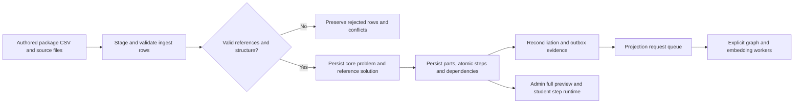
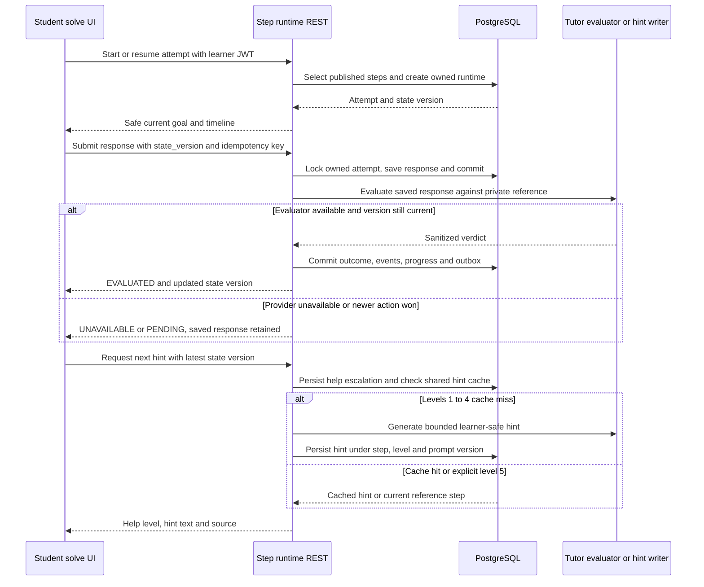
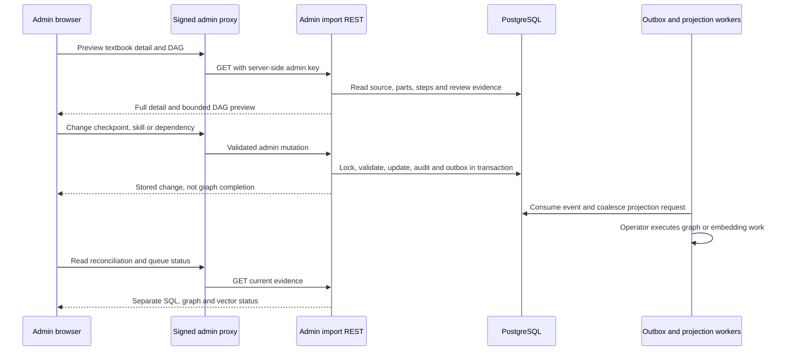
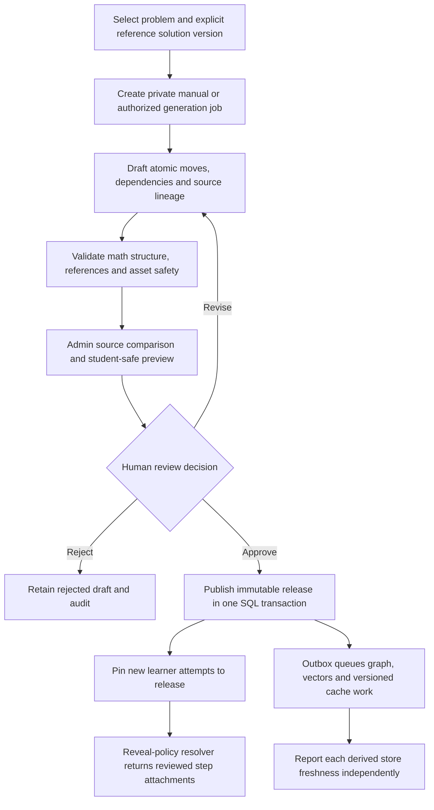

# 36. Solution-step generator, atomic authoring and attachments

## 1. Status, evidence and scope

This is the end-to-end implementation reference **and** completion specification
for turning a stored problem/reference solution into a reviewed, teachable
sequence of atomic moves. **A universal canonical step generator and full
atomic-step editor are not implemented today.** Imported textbook steps, safe
guidance stages, learner-written steps and artifact frames are different things.

Source: `375f3743357cef814c50e3c8752f7f4ce2d6ebe5`; source was clean before
this documentation task. PostgreSQL and Neo4j metadata were inspected read-only
on the user's selected REST-configured targets. The exact UTC observation
timestamps, constraints and coverage are in the
[PostgreSQL catalog](reference/postgres/README.md) and
[Neo4j metadata](reference/GRAPH_LIVE_CATALOG.md).
No generation, paid calls, migrations, uploads, admin mutations, projections or
service restarts were performed to write this document.

Primary source evidence:

- [Textbook importer](../mathbank-db/etl/import_textbook_package.py) and
  [migration 010](../mathbank-db/sql/010_textbook_import.sql).
- [Step runtime](../mathbank-rest/src/mathbank_rest/step_runtime.py),
  [routes](../mathbank-rest/src/mathbank_rest/routers/step_runtime.py),
  [hint/evaluation implementation](../mathbank-rest/src/mathbank_rest/step_tutor.py).
- [Guidance planner](../mathbank-rest/src/mathbank_rest/solution_guidance.py),
  [guided workspace](../mathbank-web/app/learn/LearningWorkspace.jsx) and
  [step solve UI](../mathbank-web/app/learn/solve/[code]/SolveWorkspace.jsx).
- [Admin DAG operations](../mathbank-rest/src/mathbank_rest/db/import_admin.py),
  [request contracts](../mathbank-rest/src/mathbank_rest/routers/admin_imports.py),
  [DAG controls](../mathbank-web/app/admin/(protected)/imports/importsClient.jsx),
  [full textbook preview](../mathbank-web/app/admin/(protected)/textbooks/problems/[code]/page.jsx).
- [Widgets](../mathbank-rest/src/mathbank_rest/widgets.py),
  [widget routes](../mathbank-rest/src/mathbank_rest/routers/fluid.py),
  [artifact runtime](../mathbank-rest/src/mathbank_rest/artifact_runtime.py),
  [artifact routes](../mathbank-rest/src/mathbank_rest/routers/artifacts.py),
  [outbox consumers](../mathbank-rest/src/mathbank_rest/outbox_worker.py).
- [Step graph projector](../mathbank-graph/etl/project_textbook_steps.py).

### Capability matrix

| Capability | Current implementation | Completion requirement |
|---|---|---|
| Reference solution storage | `core.solution`, body/kind/revision/verification | Preserve source and verification independently of teaching review |
| Canonical atomic steps | Package-authored CSV import into `pedagogy.solution_step` | Manual drafts and explicitly authorized model generation from selected solution |
| Safe roadmap | `/v1/tutor/guidance-plan`, 3-5 stages/checkpoint | Not a replacement for canonical step generation |
| Preview every step | Full admin textbook detail; DAG API text preview capped at 400 characters | Version picker, full draft preview, student-safe preview |
| Edit skill/checkpoint | PATCH API; checkpoint switch in UI | Skill selector and complete atomic content editor |
| Edit dependency edges | Add/change/reject; hard-cycle checks | Versioned whole-DAG validation and branch semantics |
| Edit prose/LaTeX; split/merge/reorder | No canonical API/editor found | Reviewed optimistic drafts with lineage and stable identities |
| Publish canonical step version | Imported steps default PUBLISHED; DAG review is separate | Explicit publication gate, immutable released versions and attempt pinning |
| Source question diagrams | Provenance/visibility records and image-serving checks | Reviewed per-step reveal policy and source-region attachment |
| Generated visuals | Deterministic widget/artifact preview and persisted bundles | Validated step-version attachment + student resolver |
| Video links | No VIDEO WidgetSpec type or canonical attachment API | Safe link attachment, rights/accessibility metadata; no arbitrary iframe |
| Hints | Shared durable levels 1-4 cache; level 5 reference reveal | Cache keys include canonical content/dependency version |
| Graph/vector synchronization | Outbox/projection queue, explicit workers | Per-release freshness/status, retry and reconciliation |

## 2. The different meanings of “step”

| Entity | Identity / source | What it means | Persistence and consumers |
|---|---|---|---|
| `core.solution_step` | UUID, `solution_id`, ordinal | Legacy core explanation/formula step | Existing table; no automatic conversion to imported steps found |
| `pedagogy.solution_step` | Text ID, source ID/occurrence/book, core solution/problem UUIDs | Canonical imported reference move | PostgreSQL; admin preview, hints/evaluator, runtime, step retrieval and graph metadata |
| Guidance stage | Selected solution ID, 3-5 stage strings | Learner-safe high-level plan | Guidance call does not insert canonical steps; agent can keep plan in ADK session JSON |
| `attempt_media.step_candidate` | Submission/transcription version | Learner-written observed move | Private evidence, explicitly approved and then assessed |
| `learner.attempt_step_state` | Attempt ID + canonical step ID | Learner response/progress/help evidence | Durable per-learner runtime state, not authored reference text |
| Artifact frame/overlay | Bundle/frame/element identifiers; optional logical linked step | A visual state or explanation frame | Ephemeral preview or persisted private bundle; not a reference-step row |
| Live plan topic | Plan/topic identity | Classroom teaching segment | `authoring.*` and `live.*`, not a canonical step editor |

`core.solution` is the full reference; `pedagogy.solution_part` groups imported
moves; `pedagogy.solution_step` holds the atomic text. A move should teach one
meaningful transformation, construction, deduction or verification, rather than
blindly splitting a paragraph at punctuation. This atomic-quality rule is a
**generation requirement**, not a current universal generator guarantee.

### Important current cardinality limitation

The runtime selects PUBLISHED steps **by problem**, ordered by
`global_step_index`, rather than accepting an explicit solution-version picker.
The live schema has a unique `(problem_id, global_step_index)` constraint.
The DAG admin lookup chooses one solution via `LIMIT 1`. Consequently, the
current data model/runtime does not support arbitrarily interleaved competing
step plans for several solution revisions. Do not advertise version selection
until the versioned design in section 8 is implemented.

## 3. Current canonical import lifecycle

The importer consumes already-authored files such as
`pedagogy_v3/csv/solution_parts.csv`,
`pedagogy_v3/csv/solution_steps.csv` and
`pedagogy_v3/csv/solution_step_dependencies.csv`.
No universal checked-in problem+solution-to-atomic-step generation endpoint was
found. “Import generated material” is not “generate canonical material”.

1. Register/stage package files and source rows in `ingest.*`.
2. Validate required text/type, occurrence identities, part/step counts, taxonomy
   references and dependency structure; preserve conflicts/reconciliation.
3. Upsert the canonical problem and a TEXTBOOK reference solution
   (`verification_status='UNVERIFIED'`), preserving source references.
4. Upsert ordered parts and steps, maintaining global/part-local indexes,
   concept/subconcept/skill IDs, tutor role, checkpoint/hint metadata, source
   pages and source metadata.
5. Respect `admin_edited_at` protection for reviewed step edits and human-owned
   dependency provenance. Human decisions must not be silently overwritten.
6. Persist dependencies, source diagrams and learning-item anchors; learning
   item visibility has its own review gate.
7. Reconcile; queue/execute downstream work separately through existing operator
   workflows. A PostgreSQL import is not proof of a completed graph/vector run.

The importer commits multiple phases. It is **not a single all-or-nothing
transaction for an entire package**.



### Dependency direction

The graph preserves the SQL `from_step_id -> to_step_id` direction.
For hard `DEPENDS_ON`, the runtime treats **from as prerequisite and to as
dependent**: it adds `from_step_id` to the prerequisites of `to_step_id`.
Do not read the English edge name backwards or silently invert it in diagrams.
`NEXT` is order metadata, not the same as a hard prerequisite.

The admin API accepts NEXT, DEPENDS_ON, DERIVES_FROM, USES_RESULT_FROM,
ALTERNATIVE_TO, BRANCHES_TO, JOINS_AT and JUSTIFIES. The current step projector
only projects NEXT, DEPENDS_ON, DERIVES_FROM, USES_RESULT_FROM, ALTERNATIVE_TO
and JOINS_AT; it normalizes source USES_RESULT to USES_RESULT_FROM.
**BRANCHES_TO and JUSTIFIES may persist in SQL without appearing in Neo4j.**
Runtime advancement uses hard dependencies only, not a complete alternative-
branch interpreter. Its fallback selects the first unfinished step when none
is ready; package/admin validation does not make this a formally verified DAG
scheduler.

## 4. Current student experience and durable runtime

### Imported-step solve UI

The `/learn/solve/{code}` workspace displays the canonical question, safe
question images/source access, progress/timeline, a current-step goal/skill,
learner math composer, feedback, progressive help, completed references and
recovery detours. It is not the admin canonical-text editor.

The ordinary runtime response includes:

- `attempt` and its state version/mode/current position.
- `current_step`: type, tutor role, skill, checkpoint, safe generic goal, help
  use, previous learner response and sanitized evaluation/diagnosis.
- `seen_steps`, `timeline`, `progress` and recovery summary.
- Future/LOCKED timeline entries omit reference content and detailed move
  metadata; completed or skipped DONE-state entries include `reference_text`.
- Explicit help level 5 returns the current canonical reference step.

Therefore, “runtime never returns step text” is too broad: **unearned future
steps are hidden, but completed/skipped references and explicit level-5 help
are intentionally revealed**. This is separate from serving source solution
pages, whose authorization/visibility follows their own handler.

### Guided workspace and streaming

The `/learn` guided workspace uses authored orientation, temporary stages,
step-bound provisional coaching and optional authored construction previews.
`/v1/tutor/guidance-plan` privately reads up to six nonempty stored solutions
(up to 12,000 characters each), prefers VERIFIED references, chooses an
applicable route and returns a learner-safe rationale/3-5 stages/checkpoint.
An authored source-gated route can avoid a model; other routes can invoke the
configured paid model. UNVERIFIED sources remain UNVERIFIED.

The plan request itself does not persist reference steps or a hint cache.
Browser drafts/stage selections are UI state; ADK lesson/conversation state
uses `agent_sessions.*`. Neither is a new canonical teaching release.

Student-facing agent streams may report task/tool progress and concise public
explanations. A complete generator should similarly show observable phases
and validation results—not private model reasoning, hidden solution content,
internal prompts or provider payloads.

### Response/evaluation/hint transaction boundaries



The start route scopes the path student ID to the JWT subject. Foreign/missing
attempts are hidden as 404. Mutations require a current `state_version >= 1`;
stale versions are 409. Reusing an idempotency key with a different operation/
body is 422. Students cannot submit their own authoritative grading outcome:
the `/outcome` endpoint is staff/tutor-internal and admin-key protected.

Responses commit before model evaluation; evaluation commits separately.
`evaluation_status='UNAVAILABLE'` retains learner work; a concurrent newer
action can yield PENDING. Hint escalation commits before hint generation; a
provider failure can return `hint_source='UNAVAILABLE'`, not fabricated text.
Do not treat help use or a successful API response as verified mastery.

## 5. What is cached, persisted or ephemeral?

| Content | Location / lifetime | Invalidations and caveats |
|---|---|---|
| Statement and full reference | `core.problem`, `core.solution` | Durable; canonical review does not refresh every derived store |
| Imported atomic moves/parts/edges | `pedagogy.solution_*` | Durable; admin/reimport protections; no immutable release snapshot today |
| Learner attempt, response, help, verdict | `learner.solve_attempt`, `attempt_step_state`, `event`; `tutor.runtime_state` | Durable, ownership-scoped; optimistic state version |
| Request replay | `learner.idempotency_record` | Durable learner/operation/body replay, not HTTP/browser caching |
| Hints 1-4 | `pedagogy.step_hint` | Durable/shared by step + level + prompt version (`step-hint-v1`) |
| Hint level 5 | Read current `step_text` | Not generated/cached; explicit reference reveal |
| Guidance roadmap/checkpoint | Returned by guidance endpoint | No canonical-step insertion or endpoint-level durable plan cache |
| ADK lesson/conversation state | `agent_sessions.sessions/events/user_states/app_states` | Framework persistence, ownership linked through learner.agent_session_link |
| Browser work/draft selections | React/browser workspace state | Not canonical authoring; do not assume reload durability |
| Deterministic visual preview | Artifact response/SVG bytes | Ephemeral, private/no-store; no bundle/assets written |
| Stored WidgetSpec | `visual.widget_spec`; session state in `visual.widget_state` | STATIC/SESSION/EPHEMERAL are declared persistence classes; separate lifecycle/review |
| Generated artifact bundle | `artifact_runtime.*` metadata + private object storage | Durable only through request/generate flow; published separately |
| Source figures | `core.problem_image`, `pedagogy.diagram`, source asset files/private store | Source usage/visibility checks; not automatic step-specific attachments |
| Step vectors | `search.*` | Derived; explicit embedding job/model/profile/version, not source truth |
| Graph step metadata | Neo4j SolutionPart/SolutionStep/LearningItem + edges | Rebuildable projection; no full step text, answer, learner response or asset bytes |

**Current hint-cache limitation:** the key does not include a step-content
hash, source-solution revision, dependency version or skill version. There is
no automatic hint invalidation in the present limited skill/checkpoint PATCH
path. A future prose/skill/context editor must not serve stale cached hints:
publish against immutable step versions or explicit content hashes and regenerate
only with authorization. Documentation does not delete/rebuild these caches.

## 6. Current admin preview and editing

### UI and API surfaces

- `/admin/textbooks/problems/{code}`: full statement/reference solution, source
  book/page metadata, parts and full atomic step text, type/skill/checkpoint,
  hints/vector status, dependencies and diagram provenance.
- `/admin/imports`: packages, issues/conflicts, reconciliation, projection queue
  and shared DAG review.
- DAG table shows a short preview; its API uses `left(step_text,400)`.
  The shared UI displays skill labels but does **not** offer a full skill
  selector or canonical prose editor.
- Checkpoint switch, dependency add/change/reject and DAG approval are implemented.
- PATCH supports skill/checkpoint/note only. A null skill is not a “clear skill”
  operation; an empty/no-op edit is invalid. Do not send `step_text` expecting
  it to be edited.
- DAG approval records APPROVED/NEEDS_REVISION and audit; it does not itself
  publish an immutable step version. Runtime eligibility checks
  `publication_status='PUBLISHED'`, not the DAG review record.



`ingest.admin_review_action` stores before/after evidence. A dependency change
checks same-problem endpoints and hard DEPENDS_ON cycles; type changes may
delete the previous edge and write a new one, while rejection preserves
REJECTED/human provenance. PostgreSQL updates and their audit/outbox are
transactional. Outbox consumers queue graph/vector requests; they do not
silently synchronize Neo4j inside the edit request.

## 7. Current visual, source-diagram and video boundaries

### WidgetSpec

The declared format is:

```json
{
  "widget_type": "FORMULA_CARD",
  "version": "1",
  "title": "A local transformation",
  "data_refs": {},
  "config": {"latex": "a(b+c)=ab+ac", "caption": "Use distributivity"},
  "interaction": {},
  "persistence": "STATIC",
  "source_lineage": {}
}
```

Use `/v1/widgets/registry` for current allowed keys/types. Implemented types
include geometry/overlay, coordinate and knowledge graphs, reasoning DAG,
number line, table, formula card, timeline, bar chart, poll result, step
progress and comparison. **VIDEO is not in the registry.**
Geometry overlays may refer to a problem/image; step progress and reasoning
DAG use a problem reference. These are not universal step-version attachment
foreign keys.

`/widgets/generate` composes a deterministic FAST path, not an LLM call.
`store=false` is display-only. Students cannot persist a spec; storing and
review/promotion require staff. Nominate before PROMOTE; promotion produces a
STATIC template. Raw HTML, JavaScript, CSS, iframes and unsafe markup/URLs are
rejected rather than accepted as a widget customization escape hatch.

### Artifact plans and bundles

- Preview: `/v1/artifacts/preview` or `/geometry-preview`; content counterparts
  return private/no-store SVG. No request/bundle/assets/index are persisted.
- Durable request: POST `/v1/artifacts/requests`; request owner and typed plan
  are stored. `linked_problem_id` is checked for existence.
- Staff generation: POST `/requests/{id}/generate`, body `{"publish":false}`;
  produces private SVG/LaTeX/frame-manifest/export-spec assets and SQL metadata.
- Overlays/equation lines/frames may carry logical text `linked_step_id`;
  the request has `linked_solution_step_id`. These are **not an enforced FK
  or a complete reviewed attachment contract to pedagogy.solution_step**.
- Stored bundle validation, publication and indexing are separate explicit
  operations. `generate_embedding=true` is explicit provider authorization;
  indexing is not automatically free or part of preview.
- Frame rendering resets to the base each time, uses stable declared element
  IDs, and supports highlight/fade transitions; MANIM_EXPORT_SPEC is a deferred
  renderer specification, **not an already-rendered video**.
- SQL and object-store writes are not globally atomic; handlers attempt scoped
  cleanup on failure, but do not claim cross-store transactions.

Source diagrams are not fabricated illustrations. Preserve source book,
page/figure/caption, image identity, rights and usage. Problem/solution
visibility boundaries remain in effect even if a widget refers to a figure.
Generated geometry must be labelled illustrative unless exact source
construction/constraints are established. A source-file path is not a public
URL and should not be returned to students.

There is no implemented universal endpoint that attaches any stored widget,
artifact, source crop or video to any canonical step, applies a reveal policy
and resolves it in `/learn/solve`. Current optional visual previews do not
close this gap. The full attachment workflow below is **proposed**.

## 8. Proposed complete generator/editor contract — NOT IMPLEMENTED

This section specifies new work; none of its proposed endpoints/tables are
part of today's OpenAPI or live schema. It extends, rather than misrepresents,
the current importer/hint/runtime.

### 8.1 Inputs, jobs and streaming

1. Select an existing canonical problem, **one explicit solution ID/revision**,
   source hashes and optional reviewed source diagrams. Reject missing,
   contradictory or insufficient sources; unverified references remain marked.
2. Support manual authoring without model use. A generation mode must require
   explicit paid consent, model/budget selection and a scoped job.
3. Persist a private generation job, input hashes, prompt/schema/model version,
   creator, status, timestamps and validation summary; do not record secrets or
   private model reasoning.
4. Stream observable progress events: SOURCE_LOADING, DRAFTING, VALIDATING,
   REVIEW_REQUIRED, FAILED and cancellation status. Events contain safe job IDs,
   counts and public rationale, not hidden solutions before authorization.
5. Return a versioned draft; do not immediately overwrite PUBLISHED steps.
   Retry must be idempotent and must not double-charge/rewrite a human draft.

### 8.2 Atomic draft content and editing

Each draft move requires:

- Stable draft step identity, part, order and explicit source-span provenance.
- One move's canonical text/LaTeX, type, tutor role and **safe student prompt
  separate from its answer-bearing canonical explanation**.
- Known concepts/subconcept/skills/techniques, checkpoint criteria and expected
  observable learner action; unknown taxonomy assignments must be flagged.
- Ordered prerequisite/next/alternative dependencies with explicit semantics.
- Optional authored hints and reviewed attachment references/reveal levels.
- Content hash/revision, edit origin and before/after audit.

Editor actions: add, modify text/LaTeX, split, merge, reorder, remove draft-only
steps, edit taxonomy/checkpoint, alter DAG and attach/detach assets. Split/merge
must preserve many-to-many lineage to source/draft predecessors and repair
dependencies/anchors. Never edit a released step in place or silently renumber
active learner references. Optimistic `expected_revision`/If-Match conflicts
must return 409 with reload guidance.

### 8.3 Validation, review, release and runtime

- Validate complete source grounding, move granularity, required fields,
  normalized math, exact referenced entities, unique order within a release,
  same-release dependencies, acyclic hard edges and reachability.
- A syntactic JSON/SVG check is not mathematical verification. Store human
  review, pedagogical approval and mathematical verification independently.
- Provide full source/draft comparison, rendered math, interactive DAG and
  student-view simulation at no-help, hints 1-4, reveal 5 and completed-step
  modes. The preview may not accidentally expose hidden later moves.
- Approve/reject/revise with immutable reviewer evidence. Publish one approved
  release atomically in PostgreSQL; never partially activate a subset of moves.
- Pin new attempts to a release/solution ID and content version. Existing
  attempts keep their release unless an explicit migration is reviewed.
- Maintain one default active release per problem while supporting independent
  alternative versions; current problem/global-order uniqueness needs deliberate
  migration, not a casual ALTER during documentation.
- Include release/content/source/dependency hashes and prompt version in hint,
  representation, artifact and retrieval cache keys.
- Queue graph/vector updates with release-qualified identities. Show separate
  SQL_PUBLISHED, GRAPH_PENDING/READY/FAILED and VECTOR_PENDING/READY/FAILED.
  Stale projections may not silently substitute for an active canonical release.
- Withdrawal retains audit/attempt evidence and blocks new assignment. It does
  not DELETE completed learner history or imply cascades are safe.

### 8.4 Step attachments

Proposed attachment types: SOURCE_DIAGRAM, WIDGET_SPEC, ARTIFACT_BUNDLE,
VIDEO_LINK and SOURCE_REFERENCE. Require a versioned attachment identity and:

| Field | Required behavior |
|---|---|
| Step release/version + ordinal | Enforced relationship to the exact authored move |
| Asset/ref ID and version/hash | Verify existence, ownership, type and publication state |
| Caption/alt text/transcript | Accessible meaningful content; no unexplained decorative diagram |
| Source/rights/provenance | Distinguish printed figure, generated illustration and licensed external video |
| Reveal policy | BEFORE_RESPONSE / HINT_LEVEL_N / AFTER_COMPLETION / STAFF_ONLY |
| Purpose | QUESTION_CONTEXT / CONSTRUCTION / EXPLANATION / REMEDIATION |
| Video location | HTTPS allowlist, start/end bounds, consent/privacy metadata; no raw iframe/HTML |
| Validation/review state | Separate safety, source correctness and pedagogical review |
| Lifecycle | Draft/published/withdrawn; removing a link does not delete source/attempt history |

For source figures, attach a validated source-image/diagram ID or region, not a
filesystem locator. For widgets, select a validated stored version or author
then validate/promote it. For artifacts, select a validated published immutable
bundle and optional frame range. For video, use an allowlisted link/player
adapter with transcript and an accessible fallback; do not insert a new
unvalidated VIDEO type or execute supplied HTML.

The student resolver must filter by release, visibility, help/completion state
and authorization before returning safe render descriptors. A staff preview
must use the **same resolver with simulated state**, not bypass every guard and
then assume the student rendering is equivalent.



### 8.5 Proposed resources and request shapes

**Design examples only; these routes do not exist.** Names are provisional and
must be finalized with migration/security/ownership design:

| Proposed route | Purpose |
|---|---|
| POST `/v1/admin/step-generation/jobs` | Create explicitly consented source-bound draft job |
| GET `/v1/admin/step-generation/jobs/{id}/events` | Safe resumable progress stream |
| GET `/v1/admin/step-drafts/{id}` | Full versioned draft/source/DAG/validation preview |
| PATCH `/v1/admin/step-drafts/{id}/steps/{step_id}` | Atomic text/LaTeX/prompt/taxonomy edit |
| POST `/v1/admin/step-drafts/{id}/steps/{step_id}/split` | Lineage-preserving split |
| POST `/v1/admin/step-drafts/{id}/merge` | Lineage-preserving merge and dependency rewrite |
| PUT `/v1/admin/step-drafts/{id}/order` | Validate and replace ordered draft IDs |
| POST `/v1/admin/step-drafts/{id}/attachments` | Validated versioned attachment |
| POST `/v1/admin/step-drafts/{id}/review` | Approve/reject/needs-revision with audit |
| POST `/v1/admin/step-drafts/{id}/publish` | Atomic approved release + outbox |

```json
{
  "problem_id": "00000000-0000-4000-8000-000000000001",
  "solution_id": "00000000-0000-4000-8000-000000000002",
  "solution_revision": 1,
  "expected_source_sha256": "<64-lowercase-hex-source-hash>",
  "mode": "MANUAL",
  "confirm_paid": false
}
```

```json
{
  "expected_revision": 3,
  "step_id": "draft-step-02",
  "kind": "VIDEO_LINK",
  "url": "https://approved-provider.example/lesson",
  "start_seconds": 40,
  "end_seconds": 85,
  "caption": "Review the construction before retrying",
  "transcript": "Accessible explanatory transcript",
  "rights_note": "Approved external teaching material",
  "reveal_policy": "HINT_LEVEL_2"
}
```

These synthetic placeholders illustrate design, not valid runnable live data.
Proposed resources must **not** be added to the source OpenAPI snapshot until
they are implemented.

## 9. Implemented REST examples

Examples are documentation only, not actions performed during this refresh.
Assume local REST `http://127.0.0.1:8000`; substitute valid synthetic/test IDs,
known step IDs (URL-encoded if necessary), JWT and server-side admin key.
Never place credentials in committed examples or browser-visible JavaScript.
Mutating/paid operations below need explicit operator authorization.

### Read-only staff previews

```http
GET /v1/admin/textbooks/problems/EXAMPLE_CH01_P001 HTTP/1.1
Host: 127.0.0.1:8000
X-Admin-Api-Key: <server-side-admin-key>
```

```http
GET /v1/admin/imports/problems/EXAMPLE_CH01_P001/dag HTTP/1.1
Host: 127.0.0.1:8000
X-Admin-Api-Key: <server-side-admin-key>
```

DAG response includes problem/selected-solution metadata, `steps`,
`dependencies`, `review`, `actions` and accepted `dependency_types`.
For full reference text, use the textbook detail response, not its truncated
DAG preview. Missing problem is 404.

### Current limited atomic metadata edit — mutation, no model

```http
PATCH /v1/admin/imports/steps/EXAMPLE_STEP_01 HTTP/1.1
Host: 127.0.0.1:8000
X-Admin-Api-Key: <server-side-admin-key>
Content-Type: application/json

{"is_checkpoint":true,"note":"Check the construction before advancing."}
```

Optional `skill_node_id` must identify an existing SKILL taxonomy node.
This route has no `expected_revision` field today, edits no canonical prose,
records audit/outbox and does not inline-project.

```http
PUT /v1/admin/imports/dependencies HTTP/1.1
Host: 127.0.0.1:8000
X-Admin-Api-Key: <server-side-admin-key>
Content-Type: application/json

{"from_step_id":"EXAMPLE_STEP_01","to_step_id":"EXAMPLE_STEP_02","relationship_type":"DEPENDS_ON","logical_dependency":"Use the preceding construction.","note":"Reviewed prerequisite."}
```

Cross-problem/invalid types are rejected; hard cycles return 409.
To change a type, provide `previous_type`; to reject, POST the same endpoint
IDs/type/note to `/v1/admin/imports/dependencies/reject`.

```http
POST /v1/admin/imports/problems/EXAMPLE_CH01_P001/dag/review HTTP/1.1
Host: 127.0.0.1:8000
X-Admin-Api-Key: <server-side-admin-key>
Content-Type: application/json

{"status":"APPROVED","note":"Reviewed move order and prerequisite semantics."}
```

### Student start, response and help — durable mutations

```http
POST /v1/students/00000000-0000-4000-8000-000000000003/problems/EXAMPLE_CH01_P001/attempts HTTP/1.1
Host: 127.0.0.1:8000
Authorization: Bearer <student-jwt>
Idempotency-Key: example-attempt-start-1
```

Success is 201 with `solve_attempt_id`, `resumed`, `replayed` and `runtime`.
No PUBLISHED steps produces 409 INVALID_TRANSITION, not automatic generation.

```http
POST /v1/attempts/00000000-0000-4000-8000-000000000004/steps/EXAMPLE_STEP_01/responses HTTP/1.1
Host: 127.0.0.1:8000
Authorization: Bearer <student-jwt>
Idempotency-Key: example-response-1
Content-Type: application/json

{"response_text":"I applied the stated relation to the two segments.","state_version":1,"evaluate":false}
```

`evaluate=false` saves without invoking the paid evaluator. Omit it or set true
only when evaluation is authorized. Refetch `/runtime` and use its actual new
state version; do not assume it stayed 1.

```http
POST /v1/attempts/00000000-0000-4000-8000-000000000004/steps/EXAMPLE_STEP_01/hint HTTP/1.1
Host: 127.0.0.1:8000
Authorization: Bearer <student-jwt>
Idempotency-Key: example-hint-1
Content-Type: application/json

{"state_version":2}
```

Help escalates one level; a levels 1-4 cache miss can call a paid model.
Expected `hint_source` includes CACHED, GENERATED, FALLBACK, REFERENCE_STEP or
UNAVAILABLE. The returned state version, not the example's literal, governs
the next mutation.

### Widget validation/storage and ephemeral geometry preview

```http
POST /v1/widgets/validate HTTP/1.1
Host: 127.0.0.1:8000
X-Admin-Api-Key: <server-side-admin-key>
Content-Type: application/json

{"audience":"STUDENT","spec":{"widget_type":"FORMULA_CARD","version":"1","title":"Distributivity","data_refs":{},"config":{"latex":"a(b+c)=ab+ac","caption":"Use distributivity"},"persistence":"STATIC"}}
```

Validation is deterministic. Persist a validated spec with POST
`/v1/widgets/specs`, body `{"spec":<validated-spec>,"source_type":"INSTRUCTOR_CREATED"}`.
The resulting widget ID is **not** automatically attached to a canonical step.

```http
POST /v1/artifacts/geometry-preview HTTP/1.1
Host: 127.0.0.1:8000
X-Admin-Api-Key: <server-side-admin-key>
Content-Type: application/json

{"subject":"GEOMETRY","topic":"Segment construction","title":"Illustrative segment","elements":[{"kind":"POINT","id":"A","x":100,"y":100,"label":"A"},{"kind":"POINT","id":"B","x":300,"y":100,"label":"B"},{"kind":"SEGMENT","id":"AB","start":"A","end":"B"}]}
```

Preview does not store/publish/index or call a paid model. Use the same plan
with `/geometry-preview/content` for SVG. The renderer/validation result does
not establish a correct source solution or a per-step attachment.

### Source-grounded guidance — potentially paid, not canonical generation

```http
POST /v1/tutor/guidance-plan HTTP/1.1
Host: 127.0.0.1:8000
Content-Type: application/json

{"problem_code":"EXAMPLE_CH01_P001"}
```

This anonymous route returns ready/unavailable and solution evidence; provider/
planning failures are surfaced by its implementation. It is not a canonical
step-authoring route, despite its generated roadmap.

## 10. Acceptance criteria for the complete generator

Completion requires all of these, not only a plausible model response:

1. Every draft identifies the selected source problem/solution revision and
   immutable input hashes; unsupported input produces an explicit error.
2. Manual mode makes zero paid calls; generation requires explicit consent/
   budget; cancellation/retry are recorded and idempotent.
3. Text edit, split, merge, reorder and dependency repair preserve source
   lineage; stale edits return 409; released content is immutable.
4. Full source and student-safe preview use the same validated content/reveal
   resolver; hidden future steps, solutions and staff assets remain hidden.
5. Review is independent from mathematical verification; UNVERIFIED sources
   cannot silently become VERIFIED through generation or approval.
6. Publication is one SQL transaction; attempt pinning prevents an active
   learner's DAG from changing after an admin edit.
7. Hint/vector/visual caches are version/hash bound; old hints cannot leak a
   withdrawn or replaced move.
8. All attachment types have ownership, rights/provenance, accessibility,
   safety and reveal checks. Video is a safe adapter/link, not arbitrary HTML.
9. Graph/vector work remains explicit, retryable and reconciled; UI reports
   queued, stale and failed stores independently of SQL publication.
10. Tests cover multiple solution versions, alternate branches, cycles,
    missing source spans, invalid IDs, concurrent edits, provider/storage
    failure, source-image visibility, frame alignment, video URL rejection,
    attempt resume and disclosure at each help/completion level.

## Related references

- [Complete PostgreSQL inventory](reference/postgres/README.md)
- [PostgreSQL relationships/DDL](reference/POSTGRES_SCHEMA.md)
- [DML and transaction boundaries](reference/POSTGRES_DML.md)
- [Source graph contract](reference/GRAPH_SCHEMA.md) and
  [observed graph metadata](reference/GRAPH_LIVE_CATALOG.md)
- [REST contracts and Swagger](reference/REST_API.md)
- [Multimodal attempts/artifacts](32_MULTIMODAL_ATTEMPTS_AND_ARTIFACTS.md)
- [Modern UI contract](30_MODERN_UI_DESIGN_SYSTEM.md)
- [Guided workspace](34_GUIDED_PROBLEM_WORKSPACE.md)
- [Corpus repair/original-practice authoring](35_CORPUS_REPAIR_AND_AUTHORING.md)
