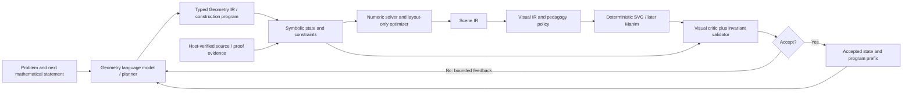
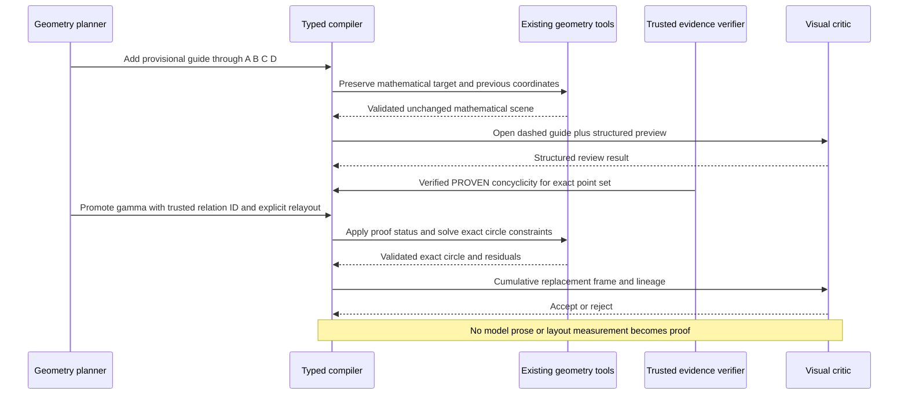

# 38 - Neural Geometry Engine / Neural-Symbolic Geometry Compiler

## NGE-SCOPE: independent project and delivery contract

Create a separate root project, [neural-geometry-engine](../neural-geometry-engine/),
for ambitious stateful neural-symbolic geometry compilation. Reuse the deterministic
tools from [requirement 37](37_GEOMETRY_SCENE_ENGINE.md), without replacing its package,
silently changing its API, or claiming its paid-model results certify this new system.

The selected initial delivery is **an executable, independently tested compiler
foundation plus the full roadmap**. Training, new paid-provider acceptance, Manim and
production integration are separately gated phases, not part of a scaffold's completion.

The learning problem is:

```text
problem/context + accepted mathematical/scene history + next statement + teaching goal
    -> structured construction-program sequence
    -> symbolic constraints + readable representative layouts
    -> cumulative scene/visual states
    -> deterministic SVG, later Manim render sequence
```

A transformer/agent may be stateful through explicit accepted state and deltas. A literal
RNN is not required. The model is a compiler front end, not a pixel generator, coordinate
oracle or proof authority. Tools enforce the backend invariants.

## NGE-ARCH: four major subsystems and three model roles

| Subsystem | Responsibility | Foundation / later work |
|---|---|---|
| Geometry Language Model | Interpret text/context into typed Geometry IR and construction programs | Typed planner interface now; configured-model adapter and semantic eval later |
| Symbolic Geometry Engine | Objects, incidence, relations, construction dependencies, proof states and constraints | Reuse `geometry_scene` now; richer explicit Constraint IR and verified theorem coverage later |
| Visual Layout Engine | Pick readable representatives within free layout degrees of freedom | Bounded angle optimizer and existing numerical solver now; general objectives/parameters later |
| Visual Critic / Pedagogy | Check rendered previews and structured states; choose focus/overlays | Provider-neutral critic plus existing visual policy now; actual multimodal critic/pedagogy adapters later |

Three logical roles may initially share a foundation model but have independent contracts:

1. **Geometry Planner**: text/current state -> typed program/delta; never SVG/pixels.
2. **Geometry Critic**: program, mathematical/scene/visual states, deterministic validation
   and rendered preview -> accept/reject plus concise correction findings.
3. **Pedagogical Visual Agent**: teaching goal/current revealed step -> visibility, styles,
   label/focus/overlay choices; cannot add facts or change proof status.

Independent review means a separate invocation/role, not a claim of statistical model
independence. Structured outcomes and evidence references are recorded; private
chain-of-thought is neither required nor displayed.



## NGE-IR: cumulative construction grammar

Use versioned, strict schemas (`nge-ir-1` initially), stable identifiers, bounded
collections and finite numeric values. Unknown fields/operations fail explicitly.

Foundation operations:

| Operation | State affected | Guard |
|---|---|---|
| CREATE_SCENE | Initial math/scene/visual state | Once, first operation only |
| APPLY_DELTA | Existing core typed state delta | CAS version, immutable givens, trusted proof status |
| ADD_PROVISIONAL_CURVE | Separate visual-guide state | Existing visible points only; no mathematical assertion |
| PROMOTE_CURVE | Trusted math status plus guide -> exact-circle lineage | Exact referenced point set; verified PROVEN concyclicity; relayout explicit |
| PRESENT | Visual state only | Existing engine policy and disclosure validation |

Compile every accepted state cumulatively:
`IR_0 -> delta_1 -> IR_1 -> ... -> IR_k`. Preserve base objects and previous coordinates
unless an explicit approved relayout is requested. A planner revision cannot overwrite
the accepted program prefix. Invalid candidates must not be published or become a
success-shaped partial sequence.

Later grammar extensions: explicit point-on-line/circle constructions, parameterized
lines with direction variables, curve replacement generalized beyond circles, symbolic
angle/length variables, higher-order construction dependencies and theorem certificates.
Do not pretend metadata declarations already implement symbolic algebra.

## NGE-LAYOUT: mathematical facts versus layout degrees of freedom

Maintain separate namespaces, provenance and serialized records:

| Mathematical | Layout-only |
|---|---|
| Symbolic theta/r/x with evidence-bound equations | theta_layout, spacing, label_offset, viewport_scale |
| GIVEN/PROVEN/constructively justified relations | Bounded choice of representative coordinates |
| Eligible for verified proof premises | Never proof premises or source quotations |
| Solve exact incidences/residuals | Optimize readability without relaxing established constraints |

For unspecified intersecting lines:

```text
line l1 through P; line l2 through P
theta_layout in [35 deg, 145 deg], preference 73 deg
objective: readable separation and weak preference proximity
```

The selected angle is not a given, not an ANGLE_MEASURE fact, and not a proof input.
The foundation generates line geometry from disjoint unconstrained point triples.
It rejects overlap, coordinate overwrites and participation in established relations
instead of silently weakening constraints. Record the chosen value as `LAYOUT_ONLY`;
discard it when a later relayout invalidates that representative.

Future general layout optimizer requirements:

- Mathematical constraints are hard; aesthetic penalties are secondary.
- Separate symbolic Constraint IR from layout objectives and seed/version metadata.
- Bounded solve/retry/time limits; no "close enough" proof or aesthetic-fit circle.
- Optimize label collisions, minimum visual angle, point separation, crop and focus.
- Detect degeneracy/unsatisfiable constraints with precise diagnostics.
- No feedback of solver measurements into mathematical truth without verified derivation.

## NGE-PROVISIONAL: sketch first, exact geometry only after evidence

Distinguish asserted geometry, construction, conjecture, layout scaffolding, visual
suggestion and proved geometry. Reuse core GIVEN, ASSUMED_FOR_CONSTRUCTION, UNKNOWN,
TARGET_TO_PROVE, PROVEN and DISPROVEN math statuses; do not make a curve a new proof fact.

| Status/category | Default visual intent |
|---|---|
| GIVEN | Normal solid asserted geometry |
| Construction | Light/dashed where appropriate; justified construction markers only |
| CONJECTURED | Subtle, dashed provisional guide with explicit label |
| VISUAL_SUGGESTION / LAYOUT_SCAFFOLDING | Separate non-proof layer; never a mathematical relation |
| TARGET_TO_PROVE / UNKNOWN | Never rendered as already true |
| PROVEN | May promote to exact geometry and stronger focus |
| DISPROVEN | No positive assertion marker for the disproven relation |

`PROVISIONAL_CURVE` uses an open smooth cubic interpolant through already visible
points. It is not a circle/arc, carries no radius/center, never enters the constraint
solver and cannot expose hidden/future points. It has a dashed low-emphasis style,
accessible non-proof description and a visible provisional label.

After external proof establishes concyclicity of exactly those points, replace the
provisional visual with the constrained exact circle and record replacement lineage.
If the previous representative is not cyclic, moving points requires explicit relayout.
The previous SVG/state remains intact. A future animation backend may morph the
transition; **static SVG replacement is not Manim morphing**.

The foundation's `TrustedFacts` argument is a trusted-host boundary, not a verifier.
Fixtures provide authored proof evidence for tests. Production must obtain evidence from
authenticated reviewed source/executable theorem paths; learner/planner-supplied "PROVEN"
or a model's explanation cannot authorize promotion.



## NGE-REUSE: existing systems and isolation

| Existing asset | Decision |
|---|---|
| Geometry Scene Engine schemas/states/deltas | Reuse installed package; strict compiler adapter |
| Solver/constraint residuals/construction planner | Reuse, do not copy/fork or relax tolerances |
| SVG renderer/policy/leakage validator | Reuse; provisional visual layer lives in new project |
| Model reasoning/presentation/review patterns | Reuse architecture; new ProgramPlanner/VisualCritic contracts need their own actual-model adapter/eval |
| Ten requirement-37 fixtures/failure traces | Later adapter regression corpus; retain original evidence and separate model metrics |
| REST auth/CAS/idempotency/private storage | Future explicit integration; no new schema or process at foundation stage |
| Tutor steps, source figures, graph and mastery | Unchanged; no write side effects, source-diagram substitution or automatic grade/step completion |

Dependency direction is `neural_geometry -> geometry_scene`, never the reverse.
The new project imports no MathBank runtime/database and starts no service.
It has its own package, CLI, environment, tests, gallery and offline CI.

Requirement 26 remains authoritative for existing source/runtime behavior.
Requirement 37 remains independently testable and its model acceptance is not improved
merely by adding this research project.

## NGE-DATA: training and evaluation records

The separate [v1 staged-annotation pilot](../neural-geometry-engine-v1/README.md) supplies
100 candidate problem packets and 900 observable stage rows. Its
[dataset/report audit](../neural-geometry-engine-v1/PROJECT_REPORT.md) distinguishes
candidate labels, 65 heuristic previews, 35 QA cards and the validated compiler backend.
It is not a trained model, gold dataset or production leakage-safe renderer.

Collect permissioned, de-identified data at four levels:

1. **Problem -> scene plan**: objects, relations, source evidence, free variables,
   construction dependencies and initial Geometry IR.
2. **Accepted state + next mathematical statement -> delta**: preserved prefix,
   added construction, proof-evidence references and disclosure scope.
3. **State + teaching goal -> visual policy**: visibility, focus, highlighting,
   label layout, circle cropping and cumulative overlays.
4. **Bad -> corrected diagram/program pairs**: failed invariant, causal diagnosis,
   permitted remedy, corrected program, renders and revalidation.

Example failure/correction labels:

- Circle misses established points -> enforce concyclicity, never aesthetic circle fit.
- Target collinearity leaked -> restore noncommittal representative until verified proof.
- Tangent contact hidden -> visible opaque contact; no premature perpendicular marker.
- Prior objects lost -> preserve cumulative base/prefix.
- Layout angle claimed as given -> reject provenance/type violation.

Record versions, seed, solver/policy/schema fingerprints, normalized program hash,
source/license/data-use approval, exact input scope, structured output, per-invariant
outcomes, rendered assets, review/retry findings and elapsed/call/usage budgets.
Do not collect private chain-of-thought, credentials or unapproved corpus/student content.
No uploads/training are automatic.

Foundation `traces.training_record` exports approved local positive sequences only.
It requires complete validated frames, matching fingerprint and source/license IDs,
and omits solver/provider debug internals. The caller remains responsible for text privacy,
licensing and review. Negative-pair export, curation UI and training infrastructure are later work.

## NGE-ROADMAP: phase gates, not optimistic completion

| Phase | Deliverable | Gate |
|---|---|---|
| 1A Foundation | Typed programs, reused solver, bounded layout, provisional/trusted transition, interfaces, independent image tests | Offline safety/replay/static checks and inspectable persistent gallery |
| 1B Strong general LLM | Configured planner/critic/pedagogy adapters with tool schemas and rendered-preview review | Real paid model suite across ten families, paraphrases, ambiguous inputs, repeated runs; no mock substitution |
| 2 Trace collection | Permissioned accepted/rejected/corrected construction traces and dataset QA | Review provenance, no leaked target/future content, train/eval split by problem family/source |
| 3 SFT / LoRA | Fine-tune program generation, not pixels; benchmark against base planner | Held-out semantic construction quality, availability, cost/latency and zero safety regression |
| 4 Critic/reranker | Good/bad scene preference pairs and independent evaluation | High recall on hard leakage/incorrect-construction negatives; calibrated rejection |
| 5 Specialized local planner | Smaller model behind the same typed compiler boundary | Benchmark parity and bounded offline deployment; no relaxation of validators |
| 6 Optional integration/animation | Authenticated REST/tutor adapter, persisted states and later Manim transitions | Owner/CAS/reveal/private storage tests, exact SVG semantics retained, browser/animation acceptance |

Initial actual-model quality gates must be fixed **before** the first certification run:
all required positive families accepted within bounded attempts, exact A1/BCD/base semantics,
safe rejection of unsupported/ambiguous/proof-forging inputs and repeat-run results retained.
Wrong objects, false proof promotion, changed givens and disclosure leaks are hard failures,
never averaged away. Report availability separately from semantic safety.

## NGE-TEST: independent testing strategy

**A. Offline compiler acceptance**

- Strict schema/unknown-op, finite values, size bounds and single initialization.
- Mathematical/layout namespace isolation and measured angle-bound correctness.
- Provisional path passes through referenced points, remains open cubic, is dashed/labelled,
  creates no circle/constraint and cannot reveal hidden/future points.
- Exact trusted point-set promotion; untrusted/wrong proof and raw-delta bypass rejection.
- No implicit movement; explicit relayout solves within inherited residual tolerance.
- Cumulative immutable snapshots, version/CAS rejection, stable seeded replay and program hash.
- Critic reviews every frame; bounded rejection/feedback; provider failure explicit.
- Accepted-prefix preservation and approved-source training export.
- Every example generates actual SVG and JSON state/validation/replay assets.

**B. Configured-model interpretation acceptance - future**

Run real configured roles on original mathematical language, paraphrases, sequential
solution statements and failure/correction examples. Include the existing ten geometry
families, A1 exactly over BCD, unspecified intersection angles, provisional-to-proven
curves, tangent contact, altitude/midpoint, large-circle arcs, similarity/collinearity
targets and changed-disclosure probes. Do not require byte-identical model plans.

Verify exact semantic invariants, not just a successful provider response.
Retain failed requests and repeated-run variation. Enforce deadlines/call/token budgets
in actual provider adapters. A compiled synthetic program or mock critic is not Suite B.

**C. Later production/visual quality**

Owner/idempotency/CAS/private assets/current-step binding tests; no grading writes;
actual accepted image display; readable desktop/mobile layouts; accessible labels;
critic render-input tests; Manim frame-by-frame invariants if animation is enabled.
Test suggestive sketches perceptually as well as checking primitive types: an open
curve prevents exact-circle semantics but cannot alone certify absence of visual inference.

## Progress and evidence

Initial foundation implemented under `neural-geometry-engine/`:
strict IR, reusable core compiler adapter, layout-only angles, provisional cubic
guides, trusted circle promotion, provider-neutral bounded planner/critic loop,
approved local trace export and three image-producing synthetic examples.

Verification commands:

```bash
make -C neural-geometry-engine test lint gallery
```

Verified local foundation results:

| Check | Observed result |
|---|---|
| Independent offline tests | **38 passed** |
| Static checks | Ruff clean; mypy no issues in **8 source files** |
| Existing backend regression | Geometry Scene Engine **72 passed**; no neural imports added to it |
| Persisted examples | **3 cases / 8 SVG frames**, full state/program/validation/replay artifacts |
| Unspecified intersection angle | Selected **82.6667 degrees**, within 35-145 degrees; no mathematical angle relation added |
| Provisional concyclicity | Target retained; open dashed cubic guide; no circle primitive or proof promotion |
| Trusted-circle realization | Concyclicity residual **1.83e-16** after explicit relayout |
| CLI replay | Both provisional and trusted-promotion replay commands succeeded |
| Browser gallery | All **8 images loaded**, no horizontal overflow at **1440px** and **390px**; promotion sequence screenshot inspected |
| Requirement diagrams | Both parsed successfully with local Mermaid; external authenticated preview tool unavailable |
| CI | Independent offline workflow added; hosted Actions execution not yet observed |

Persistent image/state evidence: [gallery](../neural-geometry-engine/output/gallery/index.html)
and [summary](../neural-geometry-engine/output/gallery/summary.json), generated locally
and intentionally excluded from Git. Regenerate using the command above; CI uploads
the same artifact shape without model calls.

Actual-model acceptance, training, general symbolic variables/Constraint IR, perceptual
critic, Manim and production integration remain **not implemented / not evaluated**.
